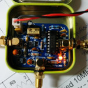
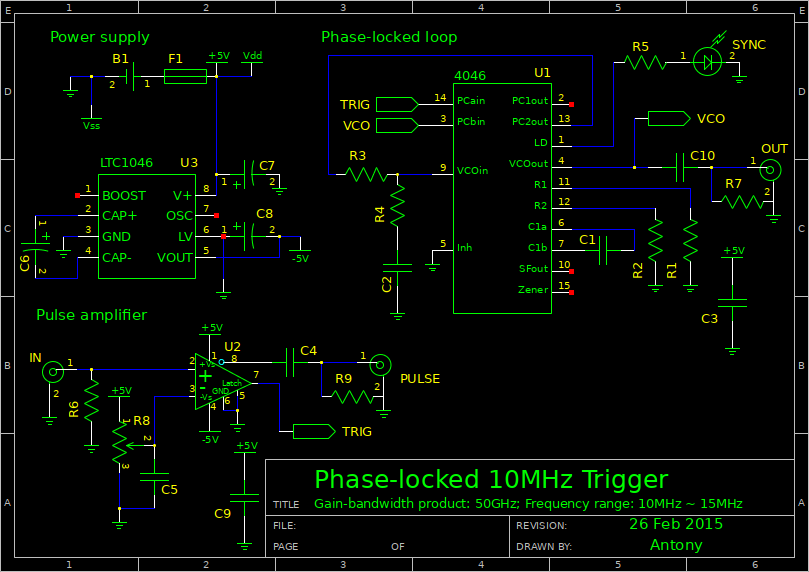
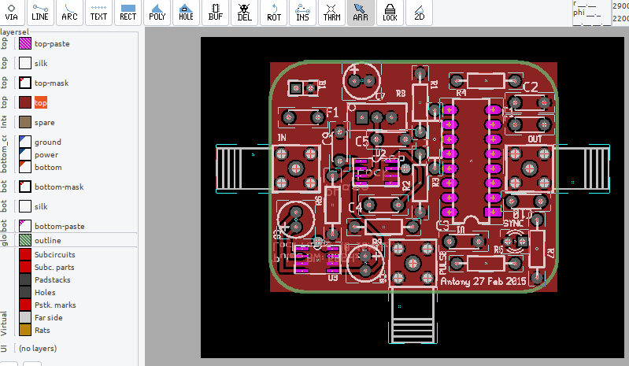
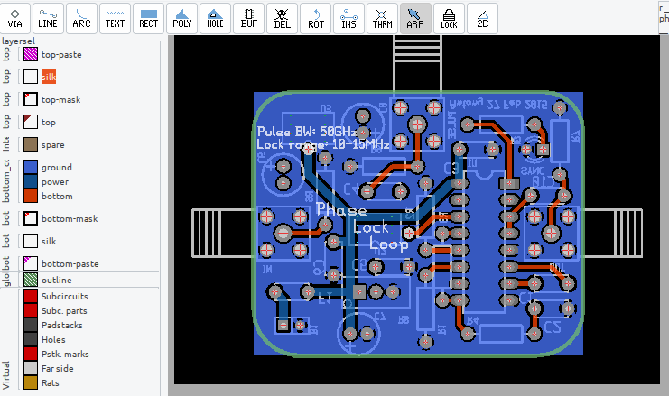
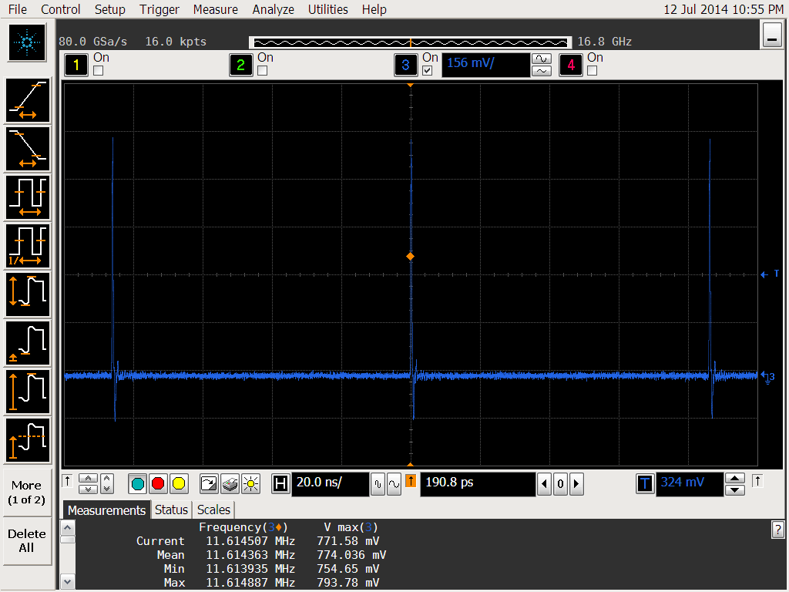
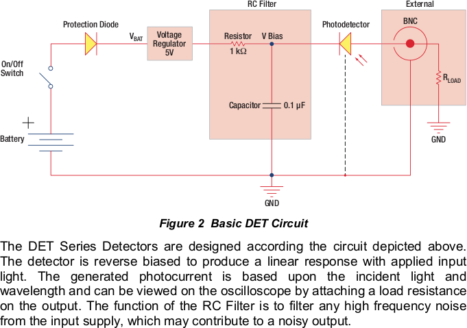
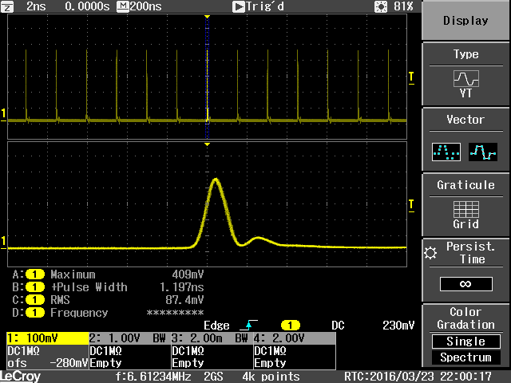
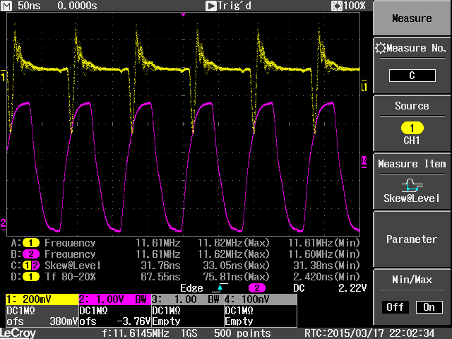

# Decoding 400 picosecond pulse train to 15 MHz clock signal

The custom PCB to convert the "raw" picosecond mode-lock laser pulse (400
femptosecond pulse width, 15 MHz pulse rate) to a TTL clock signal at 50% duty
cycle.

Technical specifications:

* Input power: 5VDC, 200mA

* Input signal: ultrafast pulse train, 50 Ohm impedance, at 400 femptosecond pulse width and 10~15 MHz pulse repetition rate. Pulse peak over-driven by the photodiode at 12VDC.

* Output: clock signal at 10~15 MHz frequency, TTL.

**Why I made my own board** My research collaborator developed a femptosecond
mode-locked fiber laser for the imaging flow cytometer project. The fiber laser
works flawlessly, but our image sensor needs to be synchronized with the laser
pulse train. So, at the time, I need to quickly prototype a microwave circuit to
decode the pulses from ultrafast photodiode sensor to a TTL clock signal.
Ultimately, the evaluation board is used to justify more investment on the
synchronization circuit to complete the research.

## Preview

The board was intentionally made to fit in a tin box. At the time, I had to justify more funding by proving that the circuit is intuitive, cheap, and deceptively simple to fabricate.

## Schematic

The comparator reference voltage should have been driven by a detected IC, e.g. TL431. The ultrafast comparator circuit can be implemented in two stages, so that the threshold voltage can be adjusted with coarse and fine potentiometer knobs.

## PCB routing

Order from OSHPark: https://oshpark.com/shared_projects/FaXqBfp3

If I were to re-design the PCB again, I would have integrated the external Photodiode sub-circuit into the main board. Also, I would have integrated a Button cell or NiMH AA battery holder to mimimize the powerline noise.

## Design intent

The overarching goal is to "slow down" the 400 femptosecond pulse from the
ultrafast photodiode circuit. To understand the extreme microwave (GHz)
requirement, refer to the introductory article of the ANDi laser
[All-normal-dispersion femtosecond fiber
laser](https://doi.org/10.1364/OE.14.010095) details.

**(Non-negotiable) external pulse sensor circuit**

**Ultrafast analog comparator**
I picked the `LT1016` IC that accepts an ultrashort pulse, over-driven at 12V at the pulse peak. The LT1016 has a 50 nanosecond bandwidth, so I utilized the circuit to "slow down" the slew-rate of the laser-trigger pulse. The slew-rate matters because at the time, ECL triggered PLL ASICs were too cost prohibitive. I can only use a 74HC PLL ASIC.

If I were to re-design the analog comparator again, I would have picked the AD8611 instead. Or, cascade two comparators in the AD8612 IC to increase the (non-compensated) total gain.

**Phase-locked loop circuit**
To convert the 50ns pulse train to a clock signal at 50% duty cycle, I implemented the PLL circuit with 74HC4046. The analog feedback circuit is favored over digital implementation because of the high clock frequency (10~15 MHz).

It is worth to note that the so-called "phase locking" in the MHz range works fundamentally different from the `"phase locking" of the mode-lock laser in the 100THz range. The former utilizes the digital comparator to retrieve the clock frequency/phase difference, and utilize feedback to control the voltage-controlled frequency generator.

In contrast, the mode-locked laser adjust its ultrafast pulse width by favoring the open-loop gain of the laser pulse at the peak power; it is the opto-electro-magnetic phase that is locked.

**Hardwiring the PLL phase error feedback PID gain**
Open loop gain $K_p(s) K_f(s) k_o(s)$

$$\begin{align*}
	K_p(s) &= \frac{Vcc}{2\pi} = 0.398V/rad \\
	K_v(s) &= \frac{1}{s} \times \frac{2 f_L \times 2\pi}{0.9 - (Vcc - 0.9)}
	= -9.187\times 10^6 \times \frac{1}{s} rad/s/V \\
	K_f(s) &= \frac{1+\tau_2 s}{1+ (\tau_1 \tau_2) s}
\end{align*}$$

where  $\tau_1 = R3 C2$ and $\tau_2 = R_4 C2$.

Characteristic equation

$$\begin{align*}
1 + K_p K_f K_o &= 0 \\
	\Rightarrow s^2 + \frac{1+K_p K_f\tau_2}{\tau_1 \tau_2} s + \frac{K_p K_v}{\tau_1 + \tau_2} &= 0.
\end{align*}$$

Natural frequency and damping factor are given as

$$\begin{align*}
\omega_n &= \sqrt{\frac{K_p K_v}{\tau_1 + \tau_2}} = ? \\ 
	\eta &= \frac{1}{2\omega_n} \times \frac{1+ K_p K_v \tau_2}{\tau_1 + \tau_2} = ?
\end{align*}$$

Choosing $\eta = 0.45$ and $\omega_n t_s = 5$, we have

$$\begin{align*}
\omega_n &= \frac{5}{t_s} =580.5 kHz \\
	\Rightarrow \tau_1 + \tau_2 &= \frac{K_p K_v}{\omega_n^2} = 11.59 \mu s
\end{align*}$$

Choosing $C_2 = 4.7 nF$

$$\begin{align*}
R_4 &= \frac{ (\tau_1 + \tau_2) \times 2 \omega_n \eta -1}{K_p K_v C_2} = 275 \Omega \\
	R_3 &= \frac{\tau_1 + \tau_2}{C_2} - R_4 = 2.19 k\Omega
\end{align*}$$

## Literatures

* Andy Chong, Joel Buckley, Will Renninger, and Frank Wise. All-normal-dispersion femtosecond fiber laser. https://doi.org/10.1364/OE.14.010095